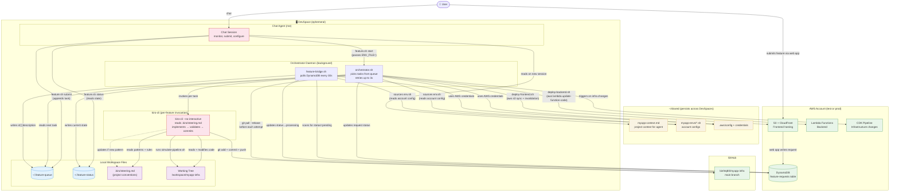

```mermaid
flowchart TB
    %% ─── User Entry Points ───
    User([👤 User])

    %% ─── DevSpace boundary ───
    subgraph DevSpace["🖥️ DevSpace (ephemeral)"]
        direction TB

        subgraph ChatAgent["Chat Agent (me)"]
            Me[Chat Session<br/>monitor, submit, configure]
        end

        subgraph Orchestrator["Orchestrator Daemon (background)"]
            direction TB
            ORC[orchestrator.sh<br/>picks tasks from queue<br/>retries up to 3x]
            Bridge[feature-bridge.sh<br/>polls DynamoDB every 30s]
        end

        subgraph KiroCLI["kiro-cli (per-feature invocation)"]
            Kiro[kiro-cli --no-interactive<br/>reads .kiro/steering.md<br/>implements → validates → commits]
        end

        subgraph LocalFiles["Local Workspace Files"]
            Queue[("~/.feature-queue")]
            Status[("~/.feature-status")]
            Steering[".kiro/steering.md<br/>(project conventions)"]
            WorkingTree["Working Tree<br/>/workspace/myapp-infra"]
        end

    end

    %% ─── Persistent Layer ───
    subgraph Persistent["~/shared (persists across DevSpaces)"]
        Context[myapp-context.md<br/>project context for agent]
        EnvFiles[myapp-envs/*.sh<br/>account configs]
        AWSCreds[.aws/config + credentials]
    end

    %% ─── External Systems ───
    subgraph GitHub["GitHub"]
        Repo[binhtq80/myapp-infra<br/>main branch]
    end

    subgraph AWS["AWS Account (test or prod)"]
        DDB[(DynamoDB<br/>feature-requests table)]
        S3[S3 + CloudFront<br/>Frontend hosting]
        Lambda[Lambda Functions<br/>Backend]
        Pipeline[CDK Pipeline<br/>Infrastructure changes]
    end

    %% ─── User interactions ───
    User -->|"chat"| Me
    User -->|"submits feature via web app"| S3
    S3 -->|"web app writes request"| DDB

    %% ─── Chat Agent interactions ───
    Me -->|"reads on new session"| Context
    Me -->|"feature.sh start<br/>(passes ENV_FILE=)"| ORC
    Me -->|"feature.sh submit<br/>(appends task)"| Queue
    Me -->|"feature.sh status<br/>(reads state)"| Status

    %% ─── Orchestrator interactions ───
    ORC -->|"sources env.sh<br/>(reads account config)"| EnvFiles
    ORC -->|"reads next task"| Queue
    ORC -->|"writes current state"| Status
    ORC -->|"invokes per task"| Kiro
    ORC -->|"git pull --rebase<br/>before each attempt"| Repo
    ORC -->|"deploy-frontend.sh<br/>(aws s3 sync + invalidation)"| S3
    ORC -->|"deploy-backend.sh<br/>(aws lambda update-function-code)"| Lambda
    ORC -->|"triggers on infra changes"| Pipeline
    ORC -->|"updates request status"| DDB

    %% ─── Bridge interactions ───
    Bridge -->|"sources env.sh<br/>(reads account config)"| EnvFiles
    Bridge -->|"scans for status=pending"| DDB
    Bridge -->|"writes id∣∣description"| Queue
    Bridge -->|"updates status→processing"| DDB

    %% ─── kiro-cli interactions ───
    Kiro -->|"reads patterns + rules"| Steering
    Kiro -->|"reads + modifies code"| WorkingTree
    Kiro -->|"runs simulate-pipeline.sh"| WorkingTree
    Kiro -->|"git add + commit + push"| Repo
    Kiro -.->|"updates if new pattern"| Steering

    %% ─── AWS auth ───
    ORC -->|"uses AWS credentials"| AWSCreds
    Bridge -->|"uses AWS credentials"| AWSCreds

    %% ─── Styling ───
    classDef persistent fill:#f9f3e3,stroke:#d4a843
    classDef ephemeral fill:#e3f2fd,stroke:#1976d2
    classDef external fill:#e8f5e9,stroke:#388e3c
    classDef agent fill:#fce4ec,stroke:#c62828
    classDef localfile fill:#f3e5f5,stroke:#7b1fa2

    class Context,EnvFiles,AWSCreds persistent
    class Queue,Status ephemeral
    class DDB,S3,Lambda,Pipeline,Repo external
    class Me,Kiro agent
    class Steering,WorkingTree localfile
```
