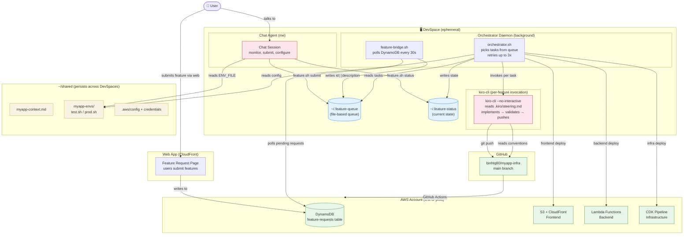

```mermaid
flowchart TB
    %% ─── User Entry Points ───
    User([👤 User])

    %% ─── DevSpace boundary ───
    subgraph DevSpace["🖥️ DevSpace (ephemeral)"]
        direction TB

        subgraph ChatAgent["Chat Agent (me)"]
            Me[Chat Session<br/>monitor, submit, configure]
        end

        subgraph Orchestrator["Orchestrator Daemon (background)"]
            direction TB
            ORC[orchestrator.sh<br/>picks tasks from queue<br/>retries up to 3x]
            Bridge[feature-bridge.sh<br/>polls DynamoDB every 30s]
        end

        subgraph KiroCLI["kiro-cli (per-feature invocation)"]
            Kiro[kiro-cli --no-interactive<br/>reads .kiro/steering.md<br/>implements → validates → pushes]
        end

        Queue[("~/.feature-queue<br/>(file-based queue)")]
        Status[("~/.feature-status<br/>(current state)")]

    end

    %% ─── External Systems ───
    subgraph Persistent["~/shared (persists across DevSpaces)"]
        Context[myapp-context.md]
        EnvFiles[myapp-envs/<br/>test.sh / prod.sh]
        AWSCreds[.aws/config + credentials]
    end

    subgraph GitHub["GitHub"]
        Repo[binhtq80/myapp-infra<br/>main branch]
    end

    subgraph AWS["AWS Account (test or prod)"]
        DDB[(DynamoDB<br/>feature-requests table)]
        S3[S3 + CloudFront<br/>Frontend]
        Lambda[Lambda Functions<br/>Backend]
        Pipeline[CDK Pipeline<br/>Infrastructure]
    end

    subgraph WebApp["Web App (CloudFront)"]
        FeaturePage[Feature Request Page<br/>users submit features]
    end

    %% ─── Connections ───
    User -->|"talks to"| Me
    User -->|"submits feature via web"| FeaturePage
    FeaturePage -->|"writes to"| DDB

    Me -->|"feature.sh submit"| Queue
    Me -->|"feature.sh status"| Status
    Me -->|"reads ENV_FILE"| EnvFiles

    Bridge -->|"polls pending requests"| DDB
    Bridge -->|"writes id∣∣description"| Queue

    ORC -->|"reads tasks"| Queue
    ORC -->|"writes state"| Status
    ORC -->|"invokes per task"| Kiro
    ORC -->|"reads config"| EnvFiles

    Kiro -->|"git push"| Repo
    Kiro -->|"reads conventions"| Repo

    ORC -->|"frontend deploy"| S3
    ORC -->|"backend deploy"| Lambda
    ORC -->|"infra deploy"| Pipeline

    Repo -->|"GitHub Actions"| AWS

    %% ─── Styling ───
    classDef persistent fill:#f9f3e3,stroke:#d4a843
    classDef ephemeral fill:#e3f2fd,stroke:#1976d2
    classDef external fill:#e8f5e9,stroke:#388e3c
    classDef agent fill:#fce4ec,stroke:#c62828

    class Context,EnvFiles,AWSCreds persistent
    class Queue,Status ephemeral
    class DDB,S3,Lambda,Pipeline,Repo external
    class Me,Kiro agent
```
