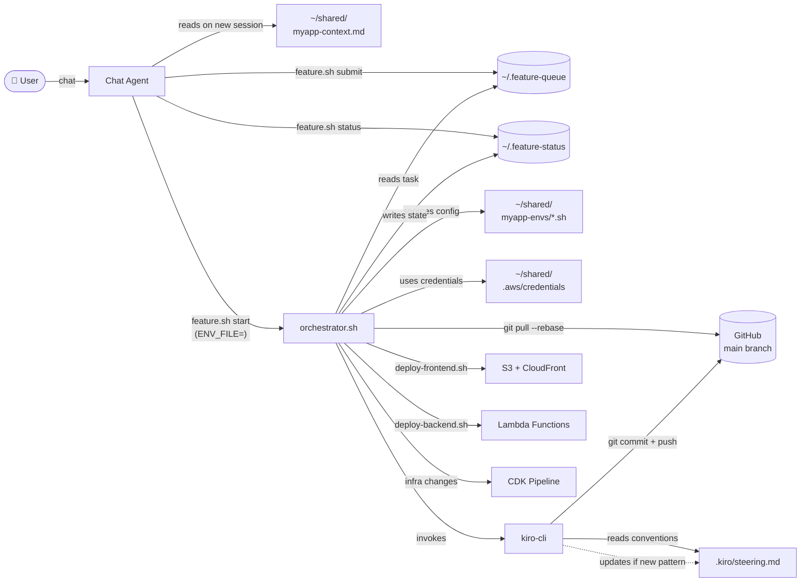
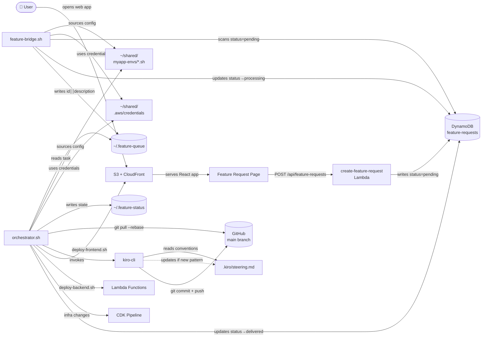
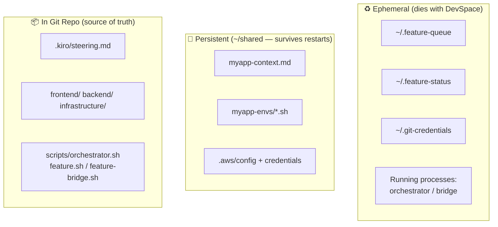
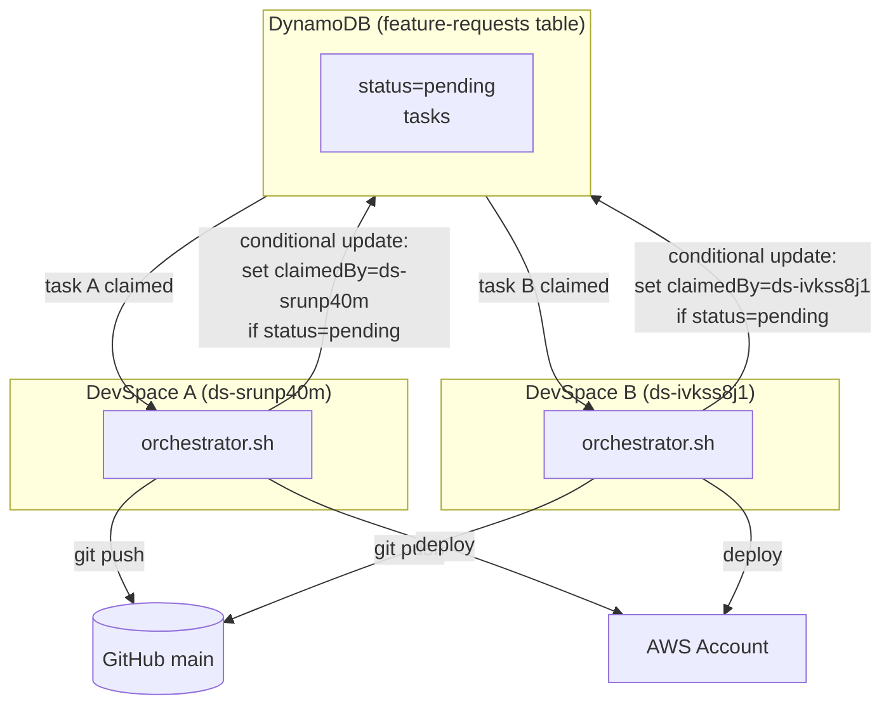
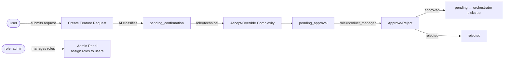

# Architecture Diagrams

## Flow 1: User → Chat Agent → Orchestrator

User talks to the Chat Agent, which submits features and starts the orchestrator loop.

## Flow 2: User → Web App → Bridge → Orchestrator

User submits a feature request through the web application. The bridge daemon picks it up and feeds it to the same orchestrator. Once in the queue, the orchestrator runs the same full implementation loop as Flow 1.

## Persistence Model

What lives where and what survives a DevSpace restart.

## Multi-DevSpace Parallel Processing

Multiple DevSpaces can target the same AWS account. Each orchestrator claims tasks atomically via DynamoDB conditional writes (no duplicates).

## Role-Based Access Control

