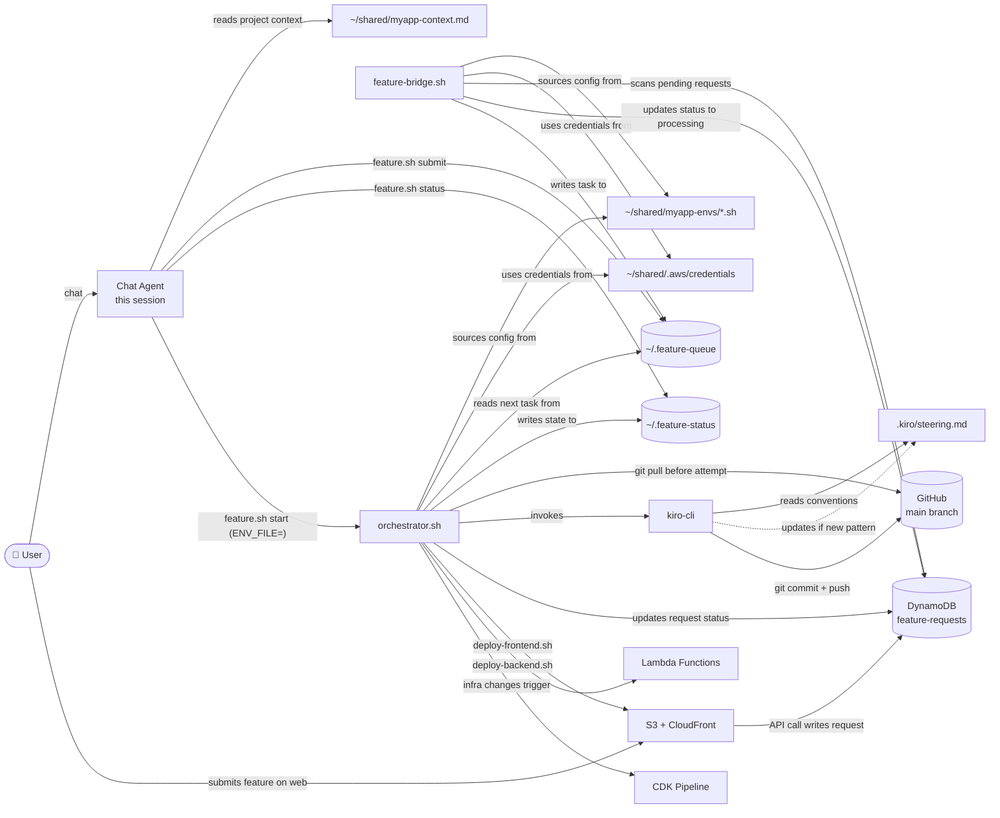
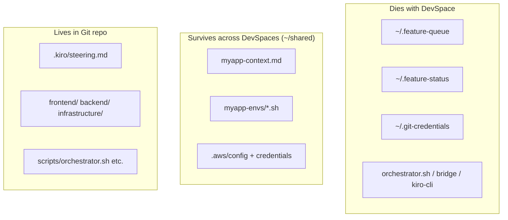

```mermaid
flowchart LR
    %% ─── Nodes ───
    User([👤 User])
    Me[Chat Agent<br/>this session]
    ORC[orchestrator.sh]
    Bridge[feature-bridge.sh]
    Kiro[kiro-cli]
    Queue[("~/.feature-queue")]
    Status[("~/.feature-status")]
    Steering[.kiro/steering.md]
    Context[~/shared/myapp-context.md]
    EnvFiles[~/shared/myapp-envs/*.sh]
    AWSCreds[~/shared/.aws/credentials]
    Repo[(GitHub<br/>main branch)]
    DDB[(DynamoDB<br/>feature-requests)]
    S3[S3 + CloudFront]
    Lambda[Lambda Functions]
    Pipeline[CDK Pipeline]

    %% ─── Flow 1: User submits via Chat Agent ───
    User -- "chat" --> Me
    Me -- "reads project context" --> Context
    Me -- "feature.sh submit" --> Queue
    Me -- "feature.sh status" --> Status
    Me -- "feature.sh start (ENV_FILE=)" --> ORC

    %% ─── Flow 2: User submits via Web App ───
    User -- "submits feature on web" --> S3
    S3 -- "API call writes request" --> DDB

    %% ─── Flow 3: Bridge polls DynamoDB ───
    Bridge -- "sources config from" --> EnvFiles
    Bridge -- "uses credentials from" --> AWSCreds
    Bridge -- "scans pending requests" --> DDB
    Bridge -- "updates status to processing" --> DDB
    Bridge -- "writes task to" --> Queue

    %% ─── Flow 4: Orchestrator processes queue ───
    ORC -- "sources config from" --> EnvFiles
    ORC -- "uses credentials from" --> AWSCreds
    ORC -- "reads next task from" --> Queue
    ORC -- "writes state to" --> Status
    ORC -- "git pull before attempt" --> Repo
    ORC -- "invokes" --> Kiro
    ORC -- "updates request status" --> DDB
    ORC -- "deploy-frontend.sh" --> S3
    ORC -- "deploy-backend.sh" --> Lambda
    ORC -- "infra changes trigger" --> Pipeline

    %% ─── Flow 5: kiro-cli implements feature ───
    Kiro -- "reads conventions" --> Steering
    Kiro -. "updates if new pattern" .-> Steering
    Kiro -- "git commit + push" --> Repo
```

---

```mermaid
flowchart TB
    %% ─── Persistence Diagram ───
    subgraph Ephemeral["Dies with DevSpace"]
        Queue2[~/.feature-queue]
        Status2[~/.feature-status]
        GitCreds2[~/.git-credentials]
        Processes2[orchestrator.sh / bridge / kiro-cli]
    end

    subgraph Persists["Survives across DevSpaces (~/shared)"]
        Context2[myapp-context.md]
        EnvFiles2[myapp-envs/*.sh]
        AWSCreds2[.aws/config + credentials]
    end

    subgraph InRepo["Lives in Git repo"]
        Steering2[.kiro/steering.md]
        Code2[frontend/ backend/ infrastructure/]
        Scripts2[scripts/orchestrator.sh etc.]
    end
```
