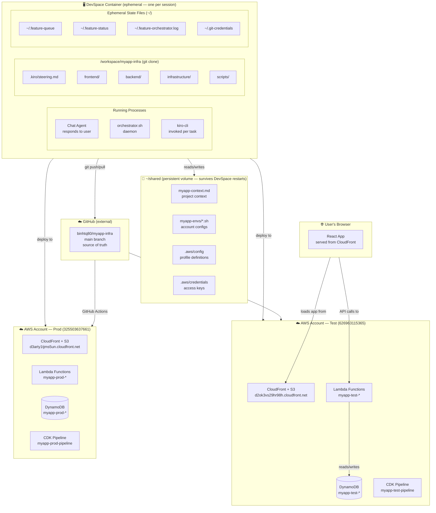

# Component Location Diagram

Where each component lives physically.

```mermaid
flowchart TB
    subgraph DevSpace["🖥️ DevSpace Container (ephemeral — one per session)"]
        direction LR

        subgraph Processes["Running Processes"]
            ChatAgent[Chat Agent<br/>responds to user]
            ORC[orchestrator.sh<br/>daemon]
            KiroCLI[kiro-cli<br/>invoked per task]
        end

        subgraph Workspace["/workspace/myapp-infra (git clone)"]
            Steering[.kiro/steering.md]
            Frontend[frontend/]
            Backend[backend/]
            Infra[infrastructure/]
            Scripts[scripts/]
        end

        subgraph EphemeralFiles["Ephemeral State Files (~/)"]
            Queue[~/.feature-queue]
            Status[~/.feature-status]
            Logs[~/.feature-orchestrator.log]
            GitCreds[~/.git-credentials]
        end
    end

    subgraph SharedVolume["💾 ~/shared (persistent volume — survives DevSpace restarts)"]
        direction LR
        Context[myapp-context.md<br/>project context]
        EnvFiles[myapp-envs/*.sh<br/>account configs]
        AWSConfig[.aws/config<br/>profile definitions]
        AWSCreds[.aws/credentials<br/>access keys]
    end

    subgraph GitHub["☁️ GitHub (external)"]
        Repo[binhtq80/myapp-infra<br/>main branch<br/>source of truth]
    end

    subgraph AWSTest["☁️ AWS Account — Test (626963115365)"]
        direction LR
        TestCF[CloudFront + S3<br/>d2ok3vs29hr98h.cloudfront.net]
        TestLambda[Lambda Functions<br/>myapp-test-*]
        TestDDB[(DynamoDB<br/>myapp-test-*)]
        TestPipeline[CDK Pipeline<br/>myapp-test-pipeline]
    end

    subgraph AWSProd["☁️ AWS Account — Prod (325503637661)"]
        direction LR
        ProdCF[CloudFront + S3<br/>d3arty1tjms5un.cloudfront.net]
        ProdLambda[Lambda Functions<br/>myapp-prod-*]
        ProdDDB[(DynamoDB<br/>myapp-prod-*)]
        ProdPipeline[CDK Pipeline<br/>myapp-prod-pipeline]
    end

    subgraph UserBrowser["🌐 User's Browser"]
        WebApp[React App<br/>served from CloudFront]
    end

    %% ─── Relationships ───
    DevSpace -- "git push/pull" --> GitHub
    DevSpace -- "deploy to" --> AWSTest
    DevSpace -- "deploy to" --> AWSProd
    DevSpace -- "reads/writes" --> SharedVolume
    GitHub -- "GitHub Actions" --> AWSTest
    GitHub -- "GitHub Actions" --> AWSProd
    UserBrowser -- "loads app from" --> TestCF
    UserBrowser -- "API calls to" --> TestLambda
    TestLambda -- "reads/writes" --> TestDDB
```
